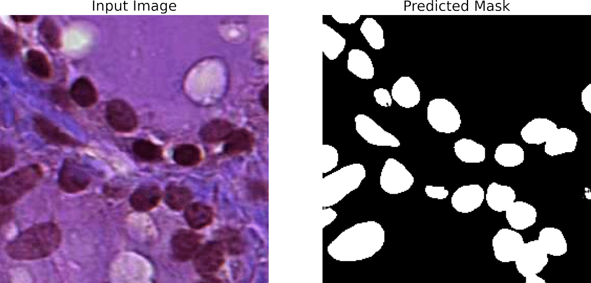
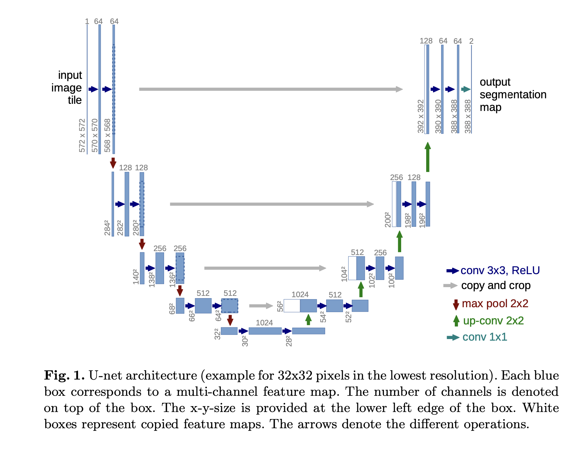

# Nucleus Segmentation with U net
Based on U-net architecture, trained on Pannuke dataset.

Input image & predicted mask resolution: 256x256 

# Result
### Dice Score: 85.1%
### Accuracy: >95%


# U-Net Architecture

[U-Net: Convolutional Networks for Biomedical Image Segmentation](https://arxiv.org/abs/1505.04597)

# Loss Function and Metric

**Loss Function:**

```python
def Dice_Loss(y_true, y_pred):
    y_true = tf.cast(y_true, tf.float32)
    y_pred = tf.cast(y_pred, tf.float32)
    inter = tf.math.multiply(y_true, y_pred)
    union = tf.math.divide(tf.math.add(
        tf.reduce_sum(y_true), tf.reduce_sum(y_pred)), 2)
    score = tf.math.divide(tf.reduce_sum(inter), tf.reduce_sum(union))
    loss = tf.math.subtract(tf.constant(1.0), score)
    return loss
```
Loss function inspired from: [Using Intersection over Union loss to improve Binary Image Segmentation](https://www.semanticscholar.org/paper/Using-Intersection-over-Union-loss-to-improve-Image-Beers/b0095bffa2cb5b487d690a0bf9b3bf529126c417)

**Metric:**

```python
def Dice_Score(y_true, y_pred):
    y_true = tf.cast(y_true, tf.float32)
    y_pred = tf.math.greater(y_pred, 0.5)
    y_pred = tf.cast(y_pred, tf.float32)
    inter = tf.math.multiply(y_true, y_pred)
    union = tf.math.divide(tf.math.add(
        tf.reduce_sum(y_true), tf.reduce_sum(y_pred)), 2)
    score = tf.math.divide(tf.reduce_sum(inter), tf.reduce_sum(union))
    return score
```

# DataSets
[Original Dataset (Numpy format)](https://jgamper.github.io/PanNukeDataset/)

[Exported Dataset (PNG format) and Pretrained Model (TensorFlow)](https://www.kaggle.com/datasets/llwlabs/pannuke)
